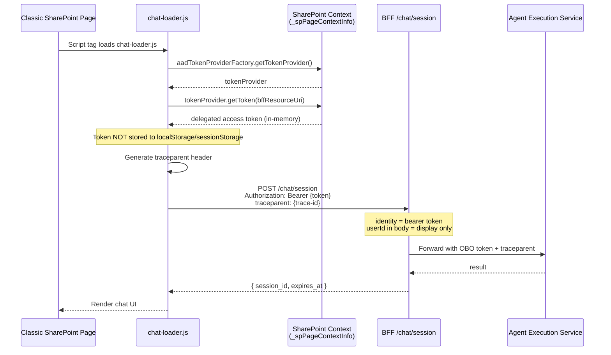
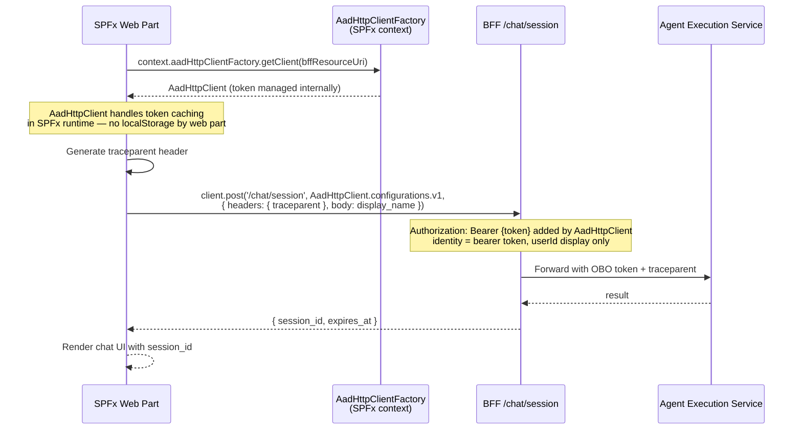
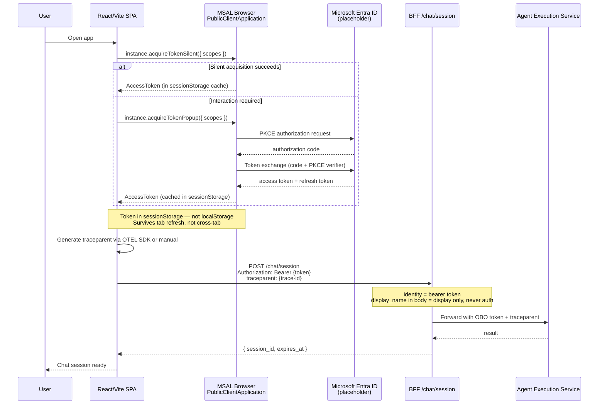

# Spec 007 — Design

**Spec:** 007-variant-client-implementations
**Milestone:** M7
**Updated:** 2026-06-01
**Note:** This is a planning artifact for the spec-first gate. No client code exists yet. Diagrams represent the intended flows.

---

## Architecture Overview

### M7 Scope Boundary

```
Browser / SharePoint / SPFx
         │
         │  (1) Acquire delegated token
         │      via MSAL / AadHttpClient / SharePoint context
         │
         │  (2) POST /chat/session
         │      Authorization: Bearer {delegated-token}
         │      traceparent: 00-{trace-id}-{span-id}-01
         ▼
┌──────────────────────────────────────────┐
│  BFF (Python FastAPI)                    │  ◄── M7 boundary: clients call BFF only
│  • Validates bearer token (JWKS)         │
│  • identity = bearer token, NOT userId   │
│  • Returns session_id                    │
│  • Propagates traceparent downstream     │
└──────────┬───────────────────────────────┘
           │  (3) OBO exchange + forwarded traceparent
           ▼
┌──────────────────────────────────────────┐
│  Agent Execution Service (Python)        │  ◄── Backend unchanged in M7
│  • Blueprint audience validation         │
│  • OBO token to MCP                      │
└──────────┬───────────────────────────────┘
           │  (4) OBO token + traceparent
           ▼
┌──────────────────────────────────────────┐
│  MCP Protected API (Python)              │  ◄── Backend unchanged in M7
│  • OBO token validation                  │
└──────────────────────────────────────────┘

Tracing visualization:
  Local dev: Jaeger UI  localhost:16686
  Deployed:  Azure Monitor (OTLP endpoint swap — M6 baseline)
```

---

## Variant A — SharePoint Classic Loader

### Token Acquisition Flow



### Key implementation notes
- Token provider is a pluggable callback: `loadChat({ tokenProvider: async () => token })`.
- Default implementation uses `_spPageContextInfo.aadTokenProviderFactory`.
- Stub implementation for local mock: `async () => 'mock-bearer-token'`.
- `traceparent` generated as `00-{random-32hex}-{random-16hex}-01`.
- No `localStorage.setItem` or `sessionStorage.setItem` calls for the token.
- Classic pages have no iframe isolation — minimize token lifetime in memory (use immediately, discard reference).

---

## Variant B — SPFx Web Part

### Token Acquisition Flow



### Key implementation notes
- `bffResourceUri` is the Application ID URI of the BFF Entra app registration (placeholder: `api://{client-id}/`).
- `webApiPermissionRequests` in `package-solution.json` must list the BFF scope with placeholder values.
- `AadHttpClient` automatically attaches the `Authorization: Bearer` header.
- Web part code must NOT call `localStorage.setItem` or `sessionStorage.setItem` for token storage.
- The web part property pane must expose `bffBaseUrl` and `bffResourceUri` as configurable (placeholder defaults).
- Modern SharePoint runs web parts in isolated iframes — token is not accessible to other web parts.

---

## Variant D — SPA / Public Client (React + Vite)

### Token Acquisition Flow



### MSAL configuration (placeholder)

```typescript
// apps/spa-public-client/react-vite/src/authConfig.ts
// ⚠️ PLACEHOLDER — replace {tenant-id} and {client-id} with real values before deploying
export const msalConfig: Configuration = {
  auth: {
    clientId: import.meta.env.VITE_ENTRA_CLIENT_ID,   // {client-id}
    authority: `https://login.microsoftonline.com/${import.meta.env.VITE_ENTRA_TENANT_ID}`,
    redirectUri: window.location.origin,
  },
  cache: {
    cacheLocation: 'sessionStorage',  // NOT localStorage — security requirement
    storeAuthStateInCookie: false,
  },
};

export const bffRequest = {
  scopes: [import.meta.env.VITE_BFF_API_SCOPE],  // {bff-api-scope}
};
```

### Key implementation notes
- `cacheLocation: 'sessionStorage'` is required (NFR-08). `localStorage` is prohibited.
- `acquireTokenSilent` first; `acquireTokenPopup` as fallback.
- `traceparent` generated via `@opentelemetry/api` auto-instrumentation or manual construction.
- The BFF call must include `credentials: 'include'` only if BFF session cookies are used (not applicable in M7).
- `display_name` (optional) may be included in POST body as display hint only — never used for auth.

---

## BFF Extensions Required in M7

### CORS Configuration
The BFF `CORS_ALLOWED_ORIGINS` env var must be set to permit client origins for local dev:
```
# config/env/bff.env.example addition
CORS_ALLOWED_ORIGINS=http://localhost:5173,http://localhost:3000
```
> No wildcard. No `*`. Explicit origins only (enforced in existing `main.py`).

> **T11 Implementation Condition (T00):** The current `main.py` CORS `allow_headers` list
> (`["Authorization", "Content-Type", "x-correlation-id"]`) does not include `traceparent`.
> Browser clients will be blocked by CORS preflight when they attempt to send the W3C
> `traceparent` header. T00 must add `"traceparent"` to the `allow_headers` list.

### `/chat/session` Body Extension (Decision R3 — T11)
If T11 approves, add an optional `display_name` field to the `/chat/session` request body:
```python
class ChatSessionRequest(BaseModel):
    display_name: str | None = None
    # userId and display_name are display/context only.
    # Identity is established solely by the validated bearer token.
    # Do NOT use display_name for authorization, database keys, or downstream trust signals.
```
This field is display only. The BFF ignores it for all authorization decisions.

---

## Tracing Design

| Surface | Library | `traceparent` generation |
|---------|---------|--------------------------|
| SPA (React/Vite) | `@opentelemetry/api` + `@opentelemetry/instrumentation-fetch` | Auto-instrumented on fetch calls |
| Classic loader | None (minimal) | Manual: `00-{crypto.randomUUID().replace(/-/g,'')}-{8-byte-hex}-01` |
| SPFx web part | None (minimal) | Manual: same pattern as classic loader |

All three variants forward `traceparent` in the BFF request. The BFF already extracts and propagates it downstream (M5 instrumentation unchanged).

Span attributes from clients must NOT include raw tokens, `oid`, `sub`, `email`, `upn`, or PII.

---

## Architecture Decision Records (M7)

### ADR-M7-01 — MSAL token cache storage: `sessionStorage`

**Question:** Where should MSAL browser cache access tokens?
**Options:**
- A. `sessionStorage` (tab-scoped, cleared on tab close)
- B. `localStorage` (persistent, cross-tab readable)
- C. `memoryStorage` (in-process only, cleared on navigation)

**Decision:** Option A — `sessionStorage`. Balances UX (survives tab refresh) with security (not cross-tab readable). `localStorage` is prohibited without explicit documented justification (and raw-token writes by application code are always prohibited). `memoryStorage` causes unnecessary re-authentication on navigation.

**Binding rules enforced by T12:**
- `cacheLocation: 'sessionStorage'` MUST be set in `msalConfig.cache`.
- `storeAuthStateInCookie: false` required.
- Application code MUST NOT write raw token strings to `localStorage`, `sessionStorage`, or `IndexedDB`.
- MSAL's own managed writes to `sessionStorage` are the only permitted storage of access tokens client-side.

**Status:** ✅ ACCEPTED — Morpheus T11 (architecture) + Trinity T12 (security) 2026-06-01. OQ3 closed.

---

### ADR-M7-02 — Classic loader token provider: pluggable callback

**Question:** How should the SharePoint classic loader acquire its token?
**Options:**
- A. Pluggable callback interface (caller provides token acquisition function)
- B. Hard-coded `_spPageContextInfo.aadTokenProviderFactory` usage

**Decision:** Option A — pluggable callback. The default implementation uses `_spPageContextInfo.aadTokenProviderFactory` when available. A stub implementation supports local/mock dev. This makes the loader testable and future-safe for non-SharePoint hosts.

**Status:** ✅ Confirmed — Morpheus T11 architecture review (M7).

---

### ADR-M7-03 — Azure E2E gate: separate from M7 implementation

**Question:** Should M7 include live Azure E2E tests?
**Options:**
- A. Defer to post-M7 milestone gate (M7-AzureVerify or M8)
- B. Include as optional M7 tasks gated by opt-in env flag

**Decision:** Option A — defer. M7 is local/mock only. The post-M7 Azure E2E verification gate is **M8** (per roadmap.md — the "M7-AzureVerify" label in earlier spec drafts is superseded by M8). M8 tracks when the lab verifies the full deployed flow: client → APIM → BFF → Agent Execution Service → MCP with real Entra tokens. This gate requires explicit live Azure credentials and must not run in public CI by default. OQ5 is closed: the gate is M8.

**Status:** ✅ Confirmed — Morpheus T11 architecture review (M7). OQ5 closed: gate name is M8.

---

### ADR-M7-04 — Optional `display_name` in `/chat/session` request body (OQ1)

**Question:** Should the BFF `POST /chat/session` endpoint accept an optional `display_name` body field?

**Options:**
- A. Keep body-free (no fields accepted)
- B. Accept optional `display_name: str | None = None` (display hint only)

**Decision:** Option B — accepted. The field is `Optional[str]` with `None` default, preserving full backward compatibility. It serves as a display hint only; it must never be used for authorization, session scoping, or forwarded downstream. See ADR 0009 (`docs/adr/0009-m7-display-name-bff-body-field.md`) for binding implementation constraints.

**Binding constraints (T01):**
- Pydantic model must include the identity invariant comment.
- `display_name` must NOT appear in the session response.
- `display_name` must NOT be forwarded to Agent Execution Service or MCP Protected API.
- Negative test required: `display_name` present + no bearer token → 401.
- Max-length guard recommended (255 chars).

**Status:** ✅ Accepted — Morpheus T11 architecture review (M7). OQ1 closed. Formal ADR at `docs/adr/0009-m7-display-name-bff-body-field.md`.

---

### ADR-M7-05 — SPFx BFF token acquisition: `AadHttpClient` vs `AadTokenProvider`

**Question:** How should the SPFx web part acquire and attach a delegated access token when calling the BFF? (OQ2)
**Options:**
- A. `AadHttpClient` via `this.context.aadHttpClientFactory.getClient(bffResourceUri)` — token acquired and attached by SPFx runtime automatically; web part code never receives the raw token string.
- B. `AadTokenProvider` via `this.context.aadTokenProviderFactory.getTokenProvider().getToken(bffResourceUri)` — raw token returned to web part code; web part must attach `Authorization` header manually.

**Decision:** Option A — `AadHttpClient`. Security rationale:
1. **Token abstraction**: web part code never receives the raw token string, eliminating the risk of accidental logging, storage, or exposure in React/component state.
2. **Automatic header injection**: `AadHttpClient` attaches `Authorization: Bearer <token>` automatically; no manual header construction where mistakes can occur.
3. **Cache managed by SPFx runtime**: web part cannot accidentally persist the token.
4. **`SPHttpClient` is explicitly prohibited** for BFF calls — it injects SharePoint credentials, not BFF-scoped tokens.
5. Option B (AadTokenProvider) exposes raw token to web part code, increasing the risk of violations of token-persistence rules (§2.2 of `trinity-m7-client-security.md`).

**Binding rules enforced by T10 post-impl review:**
- Web part code MUST use `AadHttpClient` from `context.aadHttpClientFactory.getClient(bffResourceUri)`.
- `SPHttpClient` MUST NOT be used for BFF calls.
- Web part code MUST NOT call `localStorage.setItem`, `sessionStorage.setItem`, or `indexedDB.put` with any token-related data.
- `webApiPermissionRequests` in `package-solution.json` MUST reference the BFF resource only (placeholder `{client-id}` values; T-SEC-12 validation).

**Status:** ✅ ACCEPTED — Trinity T12 (security) 2026-06-01. OQ2 closed.

---

> **Roadmap note:** This gate is not part of M7 implementation. It is a named future milestone.

**Scope of M7-AzureVerify:**
1. Deploy BFF + Agent Execution Service + MCP Protected API to ACA (using M6 Terraform baseline).
2. Register placeholder Entra apps with real tenant (out-of-band; not in CI).
3. Configure each client variant with real tenant/client IDs in local `.env` (not committed).
4. Run each client variant against the deployed ACA endpoints.
5. Verify: delegated token acquired → BFF validated → Agent Execution Service OBO → MCP protected.
6. Verify: spans visible in Azure Monitor.
7. Confirm: no `userId`-auth fallback; bearer token required.

**Live test opt-in mechanism:**
```bash
LIVE_AZURE_TESTS=true  # Must be set explicitly; never in CI defaults
BFF_BASE_URL=https://{bff-aca-fqdn}
ENTRA_CLIENT_ID={real-client-id}
ENTRA_TENANT_ID={real-tenant-id}
```
